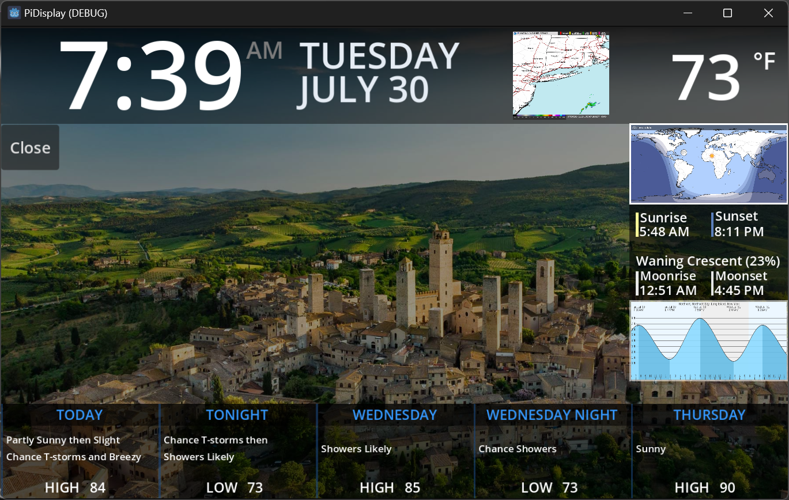
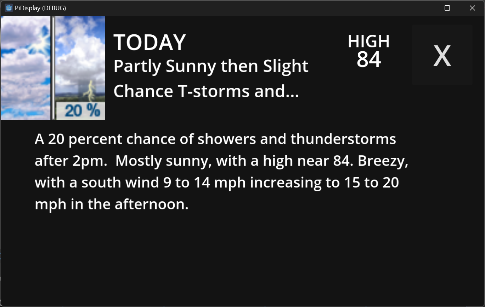
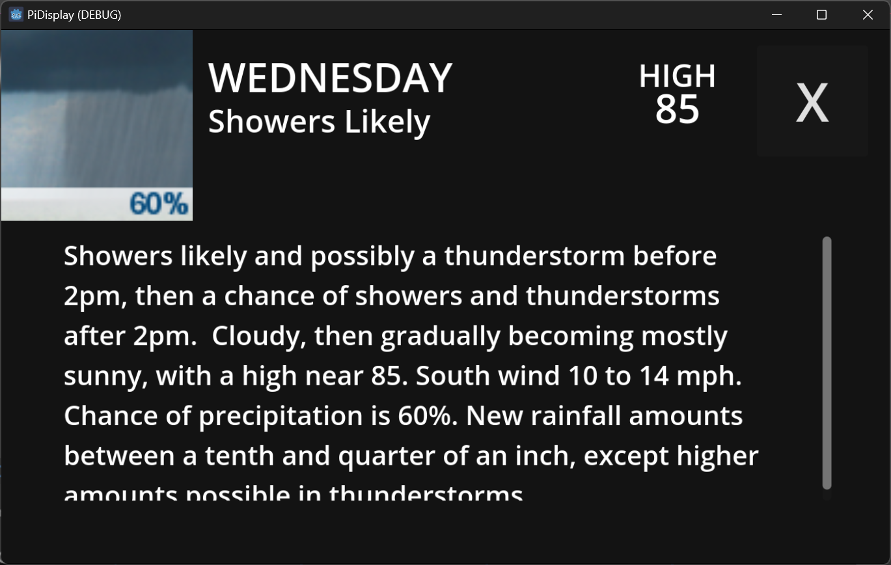
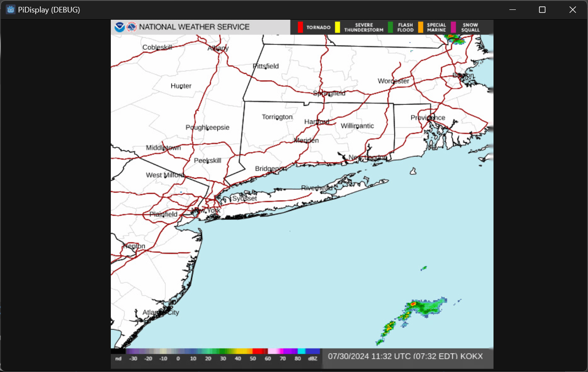
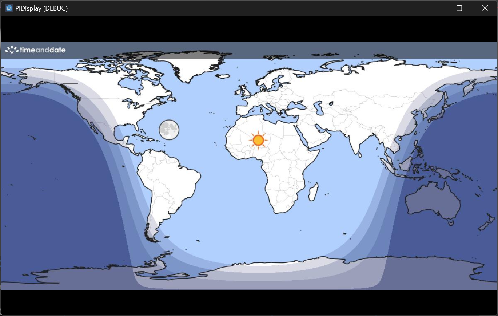
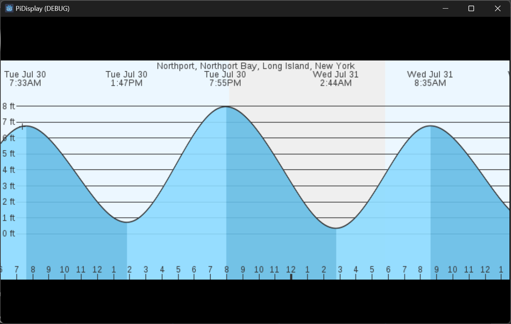

# Godot Raspberry PI Information Screen

A custom information screen written in Godot to show:

- Date
- Time
- Current temperature (weather.gov)
- Current precipitation radar animation (weather.gov)
- Five period forecast with expandable detail (weather.gov)
- Day and night image across the earth (timeanddate.com)
- Sunrise, sunset, moonrise, moonset, moon phase, moon fracillum (USNO)
- Tide forecast (marineweather.net)

## Usage

This is a personal project and is not set up for easy configuration. However, it is a fairly simple project and would not be difficult to customize. Do not use this as a Godot tutorial as I was learning as I go :)

## Screenshots

